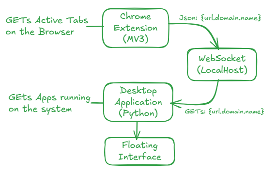

# Cheat Buster - Interview Transparency Monitor

Online interviews have introduced a new challenge: Where Candidates can use AI tools and hidden browser tabs that are **not visible** to interviewers during screen sharing.

**Cheat Buster** is a hybrid **desktop + browser transparency system** designed to prevent AI-assisted cheating during online interviews by making all active applications and websites **visibly transparent** to the interviewer via screen sharing.

Cheatings in Online Interviews! Not any more.

Cheat Buster solves this by:
- Displaying all **active desktop applications**
- Displaying all **active browser tabs**
- Showing everything in a **floating overlay** that is shared on screen

---

## 🛠 Tech Stack

### Desktop App
- Python
- PyQt6
- psutil
- pywin32
- websockets

### Browser Extension
- JavaScript
- Chrome Extensions (Manifest V3)
- Tabs API
- WebSocket client

---

## Working



---

## ✨ Features

### 🖥 Desktop Application
- Detects user-visible OS applications (Windows Only)
- Filters system/background noise
- Draggable floating overlay
- Minimize to compact header
- Always-on-top (screen-share visible)

### 🌐 Chrome Extension
- Manifest V3 compliant
- Event-driven tab tracking
- Extracts tab titles and domains

### 🔌 Real-Time Sync
- Local WebSocket communication
- Zero backend
- Zero cloud

---

## Setup Instruction

### 1️⃣ Clone the Repository
```bash
git clone https://github.com/Arkam-X/Cheat-Buster.git
cd Cheat-Buster

2️⃣ Create & Activate Virtual Environment
bash
Copy code
python -m venv venv
venv\Scripts\activate

3️⃣ Install Dependencies
bash
Copy code
pip install -r requirements.txt

4️⃣ Run the Desktop Application
bash
Copy code
python app.py

5️⃣ Load Chrome Extension
Open chrome://extensions
Enable Developer Mode
Click Load unpacked
Select the chrome-extension/ folder

6️⃣ Usage During Interview
Start Cheat Buster
Ensure the overlay is visible
Share screen with interviewer

---
Developed by **Arkam Chaudhary**😎